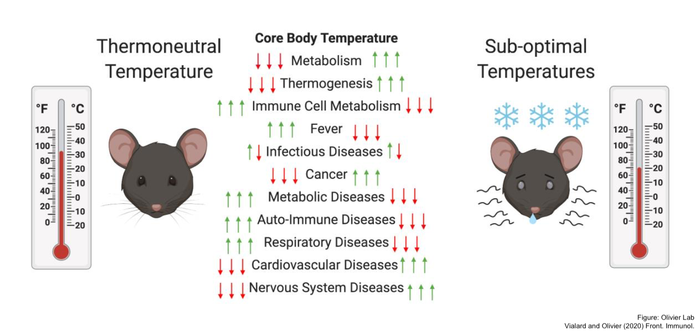
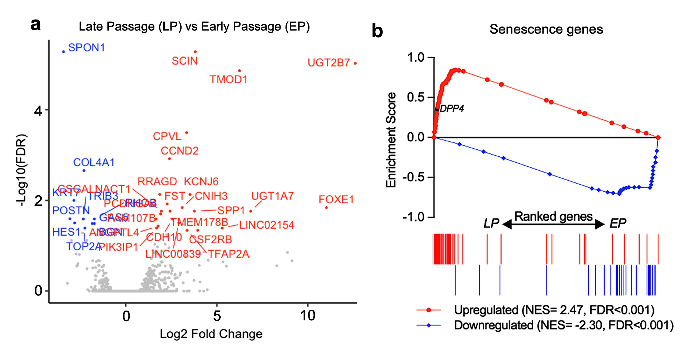
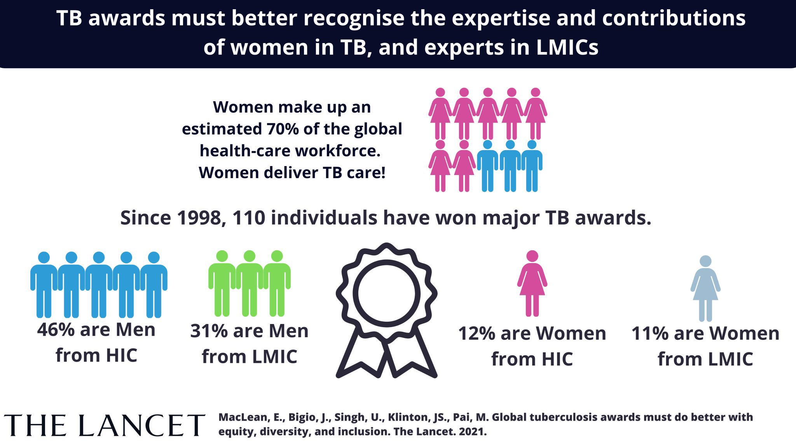
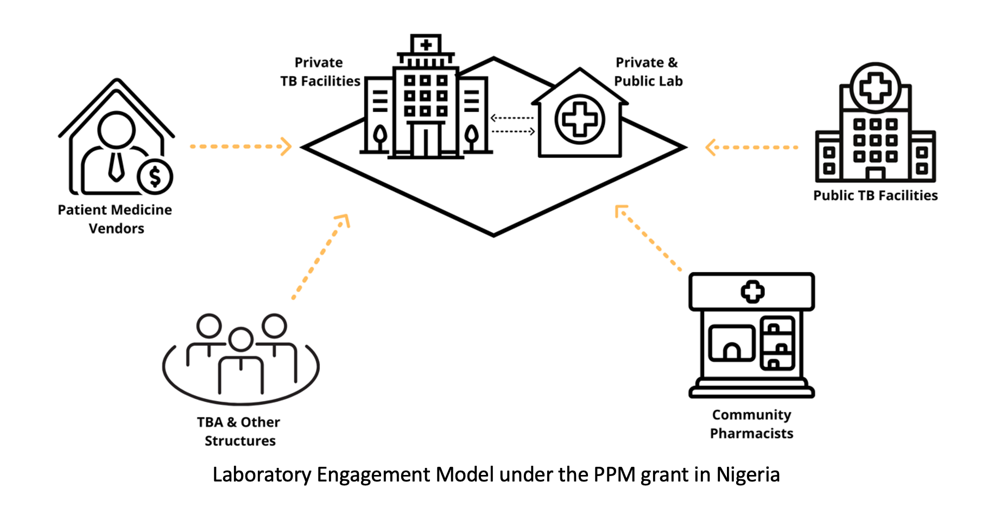
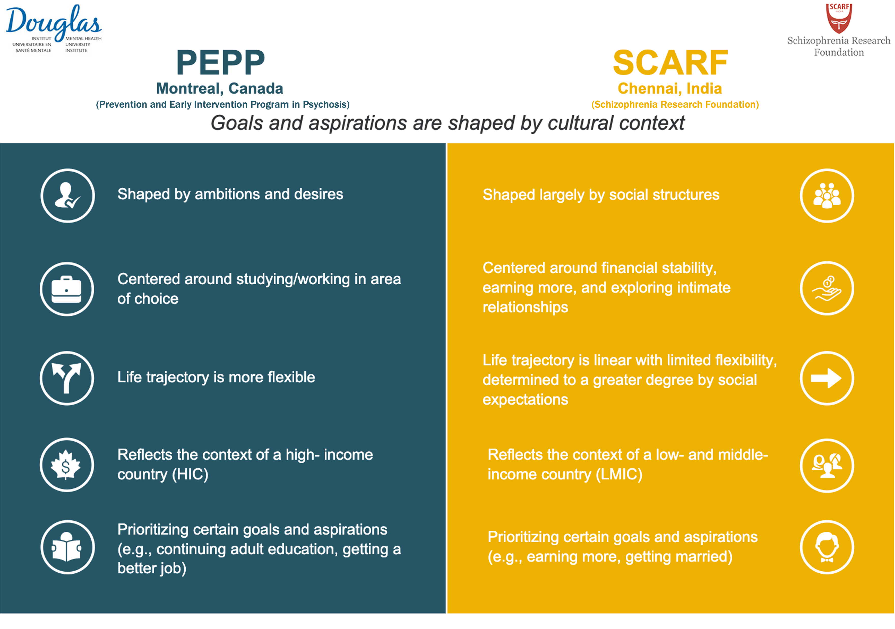
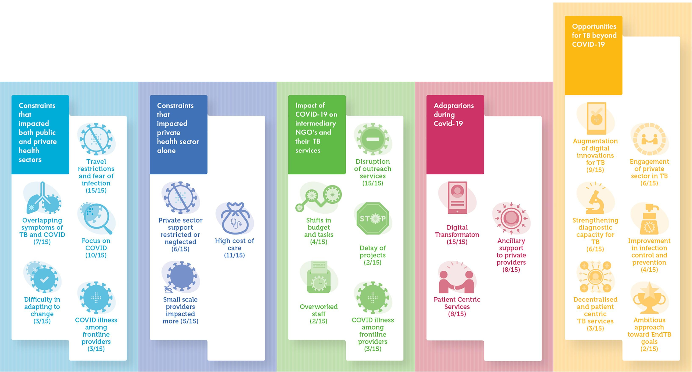

    <!--
 -->
    
See my <a class="a-link" href="https://scholar.google.com/citations?user=ad518uQAAAAJ&hl=en" target="_blank">Google Scholar. </a> Jump to <a class="a-link" href="#bioinformatics-projects"> bioinformatics</a> or <a class="a-link" href="#other-projects">other projects</a>.
 
    <!--
-->

  

<h5 id="bioinformatics-projects" class="page-heading">Bioinformatics Projects</h5>

   

    

    
    

    
  
        
<b>Impact of thermoregulation on the immune response to malaria and <i>Leishmania</i> infection in a mouse peritonitis model</b>  
        <i>Ongoing project (<a class="a-link" href="https://www.langlaislab.com/" target="_blank">Langlais Lab</a>, McGill Genome Center and <a class="a-link" href="https://www.mcgill.ca/microimm/martin-olivier" target="_blank">Olivier Lab</a>)</i> 
        <i>Publication in progress</i>

        
Much of the research conducted on mice models does not translate well to human clinical trials due to differences in data reporting, study parameters, and the "mouse vs human metabolism" problem. Here, we investigate impact on the murine immune response to malaria and <i>Leishmania</i> infection when C57BL/6 mice are housed at sub-optimal and <a class="a-link" href="https://www.frontiersin.org/articles/10.3389/fimmu.2020.588387/full#:~:text=In%20the%20laboratory%20setting%2C%20mice,%C2%B0C)%20(5)." target="_blank">thermoneutral temperatures</a> via <i>RNA-seq</i> and functional immunoassays. 

    

 

    

    
    

    
  
        
<b>CD26 is a Marker of Replicative Senescence in Human Adipose-derived Multipotent Mesenchymal Stromal Cells (AD-MSCs)</b>  
        <b>Urvashi Singh*</b>, Rose Triantafillia Psaroudis*, Maximilien Lora, Peter Jeon, Abigail Boursiquot, Ursula Stochaj, David Langlais, Inés Colmegna 
        <i>Till & McCulloch Meetings 2021 (TMM2021 Special Award) </i> 
        <i>Publication in progress</i>

        
In an exploratory <i>RNA-seq</i> experiment, we show that <i>DPP4</i> (CD26) is a core enriched gene in senescent AD-MSCs. Late passage AD-MSCs showed higher levels of traditional senescence markers as well as higher surface protein levels of CD26. CD26high AD-MSCs are less immunosuppressive than CD26low AD-MSCs, and we propose that CD26 can serve as a quality control readout for AD-MSC based clinical products.

    

 

  

<h5 id="other-projects" class="page-heading">Other Projects</h5>
   

    

    
    

    
  
        
<b>Global tuberculosis awards must do better with equity, diversity, and inclusion</b>  
        Emily Maclean, Jacob Bigio, <b>Urvashi Singh</b>, Joel Shyam Klinton, Madhukar Pai 
        <i>The Lancet</i>  
        <i>2021</i>

        
In this advocacy piece, we analyzed major tuberculosis awards. Most award winners were from high-income countries, despite the limited TB-burden in these areas. Only 1/5 winners were women, even as 70% of healthcare workers globally are women. It is time to advocate for equity, diversity, and inclusion.

    

    

    
    

    
  
        
<b>Partnering with the private sector to strengthen TB diagnostics in Nigeria</b>  
        Taofeekat Ali, <b>Urvashi Singh</b>, Charles Ohikhuai, Thomas Panwal, Temitope Adetiba, Aderonke Agbaje, Bolanle Olusola Faleye, Joel Shyam Klinton, Charity Oga-Omenka, Azhee-Tseja-Akinrin, Petra Heitkamp 
        <i>Publication in progress</i>

        
In this collaborative work with the Institute of Human Virology Nigeria, we studied the Nigerian “hub and spoke” model of private provider engagement to strengthen TB diagnostics. We mapped the public-private mix system, including the logistics, distribution of GeneXpert machines and other diagnostic tools, and the contribution from private labs towards case-finding. We found that the number of referrals for presumptive TB patients (in private diagnostic facilities) increased 28-fold. We propose that engaging private providers is essential to strengthen fragmented health systems for better diagnostics and treatment.

    

    

    
    

    
  
        
<b>Recovery in patients with first-episode psychosis: a comparative, cross-cultural study</b>  
        <b>Urvashi Singh</b>, Aarati Taksal, Megan Pope, Padmavati Ramachandran, Thara Rangaswamy, Ashok Malla, Srividya Iyer 
        <i>McGill Global Health Night</i> 
        <i>Publication in progress</i>

        
This study explored perceptions of recovery among youth with first-episode psychosis. A qualitative research methodology was used across the two sites: Montreal, Canada and Chennai, India. Our work highlights the value of narratives in critically unpacking notions around agency and recovery, and how they are shaped by context. Across contexts, working with these notions can promote recovery journeys of individual patients and create holistic, recovery-affirming care systems.

    

    

    
    

    
  
        
<b>Impact of COVID-19 on private provider engagement for TB in 7 high-burden countries</b>  
        Joel Shyam Klinton, Petra Heitkamp, Aamna Rashid, Bolanle Olusola Faleye, Han Win Htat, Hamidah Hussain, Imran Syed, Khalid Farough, Lalaine Mortera, Moh Moh Lwin, Nita Jha, Ramya Ananthakrishnan, Rifat Mahfuza, Sarabjit Singh Chadha, Sayera Banu, Shamim Mannan, Shibu Vijayan, Shahriar Ahmed, Taofeekat Ali, Charity Oga-Omenka, Manjot Kaur, <b>Urvashi Singh</b>, William A Wells, Guy Stallworthy, Hannah Monica Yesudian Dias, Madhukar Pai 
        <i>Journal of Clinical Tuberculosis and Other Mycobacterial Diseases</i> 
        <i>2021</i>

    

    

        
In this impact assessment study, we collaborated with epidemiologists, healthcare workers, and intermediary agencies across the 7 high TB-burden countries to understand impact of the COVID-19 pandemic on private sector providers of TB care, on TB patients, and on TB public-private mix intermediary agencies, along with their adaptations to the pandemic, and opportunities seen to improve TB care.

    

